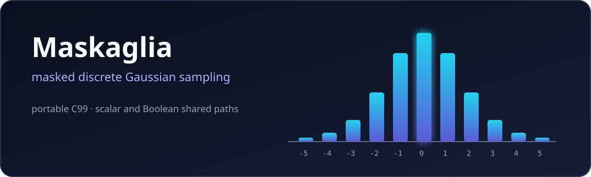
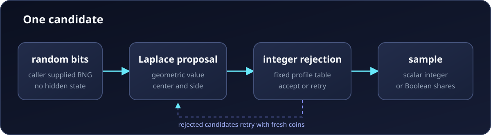

# fast-secure-gaussian-sampler

<p align="center">
  
</p>

This is a portable C99 implementation of
[Maskaglia](https://eprint.iacr.org/2026/988).

Maskaglia samples a discrete Gaussian by rejection. It draws a cheap discrete
Laplace candidate and accepts it with an integer test. Its random bit and
geometric operations are suited to bitslicing and Boolean masking.

This repository implements the paper to measure its cost. It provides a scalar
sampler and a 32 lane masked sampler for fixed profile experiments in lattice
based cryptography.

## How it works

<p align="center">
  
</p>

1. The caller provides random bytes.

2. Geometric values and a side bit create a discrete Laplace candidate.

3. A fixed table supplies the integer rejection values for that candidate.

4. The candidate is accepted or the process starts again with fresh coins.

The scalar path returns an integer. The masked path keeps each sensitive bit in
one to four Boolean shares across 32 lanes. Only refreshed rejection data
becomes public.

The finite decisions follow Algorithms 5 and 6 because Algorithms 9 12 and 13
are inconsistent. The derivation is in the [source ledger](docs/sources.md).

## Scope

| profile | sigma | centers | support |
|---|---:|---:|---:|
| `s = 3/2` | `1.2739827004320286` | `0` and `1/2` | `[-13, 13]` |
| `s = 1521/1000` | `1.2918184582380770` | `0` and `1/2` | `[-13, 13]` |

These fixed profiles approximate the ideal Gaussian. New profiles need new
tables and an independent error certificate.

The adapter maps a selected center to `2z-t` at the
[HAWK v1.1](https://hawk-sign.info/hawk-spec.pdf) sampler boundary. Its widths
do not match HAWK. It does not implement signing.

## Build

```sh
make
make test
make demo
make bench
```

`make` creates `build/libpqsamp.a`. `make adapter` creates
`build/libpqsamp_hawk.a`. See [include/pqsamp.h](include/pqsamp.h) for the API
and [examples/sample.c](examples/sample.c) for a complete example.

The caller owns the buffers and random sources. Masked calls need independent
coin and mask streams. The library has no heap or hidden RNG.

## Measurement and checks

For the pinned `s = 3/2` trace the masked path uses `6.206359863` secure ANDs
per zero center sample and `5.590454102` per half center sample. Run
`make bench` to reproduce these operation counts.

`make oracle` checks the tables with 512 bit MPFR arithmetic. Results are in
[results/profiles.json](results/profiles.json). The Makefile also provides
sanitizer fuzz CBMC stack assembly Cortex M4 and RV32 checks.

## Security status

The source follows the paper's Boolean masking structure. Secure AND uses the
PINI construction of [Cassiers and
Standaert](https://doi.org/10.1109/TIFS.2020.2971153).

This is not proof of side channel security. Current host builds spill shares
and reuse registers. There are no physical leakage measurements. This is
research code and is not ready for production. See
[docs/security.md](docs/security.md) and [docs/roadmap.md](docs/roadmap.md).

## References

1. Abou Haidar et al. [Maskaglia: A New, Efficient Approach to Masked Discrete
   Gaussian Sampling](https://eprint.iacr.org/2026/988). CRYPTO 2026.

2. Cassiers and Standaert. [Trivially and Efficiently Composing Masked Gadgets
   With Probe Isolating
   Non-Interference](https://doi.org/10.1109/TIFS.2020.2971153). IEEE TIFS
   2020.

3. Bronchain and Cassiers. [Bitslicing Arithmetic and Boolean Masking
   Conversions for Fun and Profit](https://eprint.iacr.org/2022/158). TCHES
   2022.

4. The full source record is in [docs/sources.md](docs/sources.md) and
   [docs/refs.bib](docs/refs.bib).

## License

[MIT](LICENSE)
